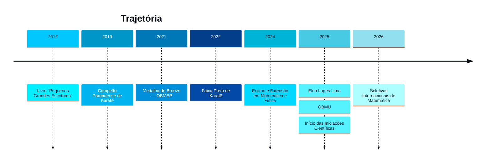

<!-- =========================== -->
<!--           BANNER            -->
<!-- =========================== -->

---

# 👨🏻‍💻 Sobre Mim

Sou **Eric Kamakawa**, estudante de **Engenharia da Computação na UTFPR**, apaixonado por **Computação Científica, Inteligência Artificial, Ciência de Dados e Desenvolvimento de Software**.

Minha formação une uma base matemática sólida, vivência em pesquisa científica e desenvolvimento de aplicações de alto desempenho — do núcleo em C++/CUDA à interface que o usuário final enxerga.

Atualmente participo de duas **Iniciações Científicas**:

- 🔹 **UEL + IMPA + CNPq** — Desenvolvimento de software para **geração de malhas computacionais aplicadas à Dinâmica dos Fluidos Computacional (CFD)**
- 🔹 **Método de Monte Carlo** — Desenvolvimento de software científico para simulação de Cristais Líquidos com **C++ e CUDA**

Tenho interesse especial por:

- Automação de Processos & Engenharia de Dados
- Inteligência Artificial & Machine Learning
- Ciência de Dados & Análise Estatística
- Computação Científica & Modelagem Numérica
- HPC (High Performance Computing)

---

# 🏆 Conquistas

🥉 Medalha de Bronze — **OBMEP (Nível 3)**

🥉 Medalha de Bronze — **Competição Nacional Elon Lages Lima (Universitário)**

🥋 Faixa Preta de Karatê

🥇 Campeão Paranaense de Karatê (2019)

---

# 🚀 Projetos em Destaque

### 🔬 McLiCS

Software desktop científico para simulações de **Monte Carlo aplicadas a Cristais Líquidos**: núcleo de cálculo em C++ com paralelização em GPU (CUDA) e interface Electron/React integrada via IPC, com pipeline automatizado de análise estatística e geração de relatórios em PDF.

**Tecnologias**

- C++
- CUDA
- Electron
- React
- Node.js

---

### 🌊 Grid Refine Solver — Mesh Generation for CFD

Pesquisa desenvolvida em parceria entre **UEL, IMPA e CNPq** para geração e refinamento automático de malhas computacionais 2D aplicadas à Dinâmica dos Fluidos Computacional. Software registrado no INPI, com suporte a formatos científicos padrão (`.msh`, `.vtk`).

**Tecnologias**

- JavaScript
- React
- Node.js
- MATLAB

---

### 📊 Data Science & Automation

Scripts e pipelines para automatizar etapas antes manuais em projetos de pesquisa — processamento estatístico de dados de simulação, geração automática de relatórios e visualizações — usando **Python** e as bibliotecas do ecossistema de dados (Pandas, NumPy, Matplotlib).

---

# 🤝 Conecte-se Comigo

---

# 💻 Linguagens

---

# ⚙️ Frameworks & Desenvolvimento

---

# 📊 Dados & Análise

---

# 🖥️ Computação Científica & HPC

---

# 🗄️ Banco de Dados, IDEs & Ferramentas

---

# 📊 GitHub Analytics

 

---

# 📈 GitHub Activity Graph

---

<!--
  🐍 EFEITO ANIMADO DE VERDADE (opcional):
  A "cobrinha" que come os quadradinhos do seu gráfico de contribuições é uma
  animação SVG real (não é imagem estática). Pra ativar no seu perfil:

  1. Crie um arquivo em .github/workflows/snake.yml no repositório kamakawa/kamakawa
     usando a Action pronta: https://github.com/Platane/snk
  2. Ela gera automaticamente o arquivo abaixo todo dia.
  3. Depois disso, essa linha passa a mostrar a animação:

  
-->

# 🕰️ Linha do Tempo

<b>📖 Ver detalhes de cada marco</b>

 

**2012–2014** — Participação nas edições do livro *Pequenos Grandes Escritores*, incentivando escrita e criatividade desde a infância.

**2019** — Campeão Paranaense de Karatê, consolidando disciplina e foco.

**2021** — Medalha de Bronze na OBMEP (Nível 3).

**2022** — Faixa Preta de Karatê aos 17 anos.

**2024** — Atuação em projetos de ensino e extensão em Matemática e Física.

**2025** — Medalha na Competição Nacional Elon Lages Lima, participação na OBMU e início de duas Iniciações Científicas.

**2026** — Convocado para seletivas de competições internacionais de Matemática.

---

